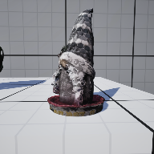

# Project Name  VRSampleMod8

## Description

A continuation of the in class demonstration code based on UE default Virtual Reality template. This one adds interactive flashlights, gradable free form and snap, and features Roy's gnome.

1) gnome model, photpgrammetry, Roy S. Winter 2025
    
 
## Usage
Clone, or download the zip, to a local directory. Open in Unreal Engine 5.4 or newer

## Attributions

